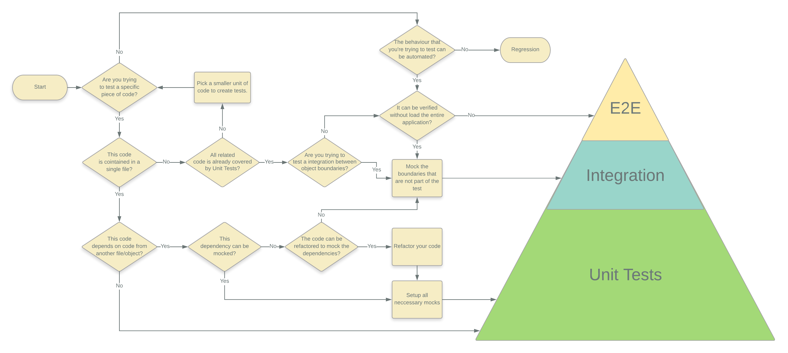

# UI Testing Guidelines

Looking for an opinionated guide to an **automated testing** structure, conventions, and best practices guide?
Step right in!
This testing style guide presents preferred conventions and, as importantly, explains why.

## Test Pyramid decision diagram

## Style vocabulary

Each guideline describes either a good or bad practice, and all have a consistent presentation.

The wording of each guideline indicates how strong the recommendation is.

**Do** is one that should always be followed.
_Always_ might be a bit too strong of a word.
Guidelines that literally should always be followed are extremely rare.
On the other hand, you need a really unusual case for breaking a _Do_ guideline.

**Consider** guidelines should generally be followed.
If you fully understand the meaning behind the guideline and have a good reason to deviate, then do so. Please strive to be consistent.

**Avoid** indicates something you should almost never do. Code examples to _avoid_ have an unmistakeable red header.

**Why?** gives reasons for following the previous recommendations.

The **Component** word is used in this guideline as a broad term of application piece, not strictly as a UI Component.

<a href="#toc">Back to top</a>

## Test Phases

The test phases presented on the pyramid above will have a deeper analysis bellow in this document, but here is a simple description of each of them.

**Unit Tests** are responsible to test units of code in isolation, unit tests should cover the specifics of the code that you've written, for example validating if it returns a expected ouput given its inputs. Unit tests doesn't cross boundaries of the unit.

[...more about unit tests](#unit-tests)

**Component Tests** have the purpose of validating how a set of units works together, testing the Components with the real implementation of its dependencies in a controlled environment. It differs from the Integration tests as here we can load parts of the application to test it's behavior independently.

[...more about component tests](#component-tests)

**Integration Tests** are responsible for testing the application as a whole without the dependency of external services and APIs. The focus of the Integration tests is to verify if the application that the user interacts works as expected.

[...more about integration tests](#integration-tests)

**E2E Tests** are tests in a real environment, including the frontend and backend of your application with all the specificities of your full architecture design (databases, proxys, third-party services and so on).

...more about unit tests (#TBD)

## Generic Tests Guidelines

_The following rules are valid for every phase of the pyramid, considering the scopes of what should be tested on each one of them_

### Test Scope

**Do** write minimally passing tests

**Why?** Small tests runs faster

**Why?** Small tests are easier to maintain

**Why?** Small tests give more precisely clues where are the issue when it breaks

**Why?** Small tests become more resilient to future changes in the codebase.

Tests that include more information than required to pass the test have a higher chance of introducing errors into the test and can make the intent of the test less clear. When writing tests you want to focus on the behavior. Setting extra properties on models or using non-zero values when not required, only detracts from what you are trying to prove.

**Consider** create a list of acceptance criterias that should be tested before starting to write code.

**Why?** Having a goal on what should be tested helps to keep your tests organized and a cleaner code.

**Why?** Acceptance criterias will help you not testing multiple scenarios on a single test.

**Why?** Helps you to forsee the pending work and pending tests.

If you're not using TDD, writing a list of `describes` and `its` even before write your _Component_ code can make you do a better planning of what is necessary to be coded and can also help to write a code that's easier to be tested, and usually code easy to test is code easy to maintain.

## Tests isolation

**Do** write isolated and independent tests.

**Why?** The execution/order of execution of one test cannot affect the others.

**Why?** Any given behaviour should be specified in one and only one test

### Organizing Tests

**Do** break your tests in multiple sub-describes, grouping them by subject, like functions or properties

**Why?** Grouping them makes it easier to idenfify what's been tested

**Why?** It allow your test file to remain organized independent of it's size.

**Do** have separated files for each phase of tests

**Why?** makes easier to

### Strings/Resources

**Do** Use global shared resources between your application code and test code.

**Avoid** magic strings, assign all your strings to constants, local or even global if necessary.

**Why?** Using constants for strings makes them reusable, so it makes harder that your tests assert in a wrong value.

**Why?** Sharing organized resources between your code and test makes your test consistent to the behavior of the code and not to a hardcoded value in the test.

### Naming Guidelines

**Do** name your variables properly. Unit tests code are still code.

**Do** use only one line for tests descriptions

**Do** describe your tests in a clear form, The name of your test should consist of three parts:

- The name of the method/component/behavior being tested.
- The scenario under which it's being tested.
- The expected behavior when the scenario is invoked.

**Why?** Naming variables and functions properly makes the test easy to understand.

**Why?** Naming standards are important because they explicitly express the intent of the test.

**Why?** Tests should be named to easily identify what have broken when it fails.

**Why?** Longer descriptions are a indicative that you are testing too much on a single test scope.

### Complexity of Tests

**Avoid** logic in test code. Tests can't be complex to write.

**Avoid** logic in test stubs or mocks. Setup multiple stubs/mocks if necessary.

**Why?** Less chance to introduce a bug inside of your tests.

**Why?** If your test is becaming complex, you are probably testing more than you should in a single test, consider break them into smaller tests

**Why?** Focus on the end result, rather than implementation details.

**Why?** Stubs and Mocks should be used to return a single result so it will always be predictable.

### Test Sequencing

**Do** create tests from simplest cases to more complex

**Why?** testing simple cases first allow that complex tests are less necessary

**Why?** testing simple cases first normally show the user what have broken first

### 3 A's convention (Arrange, Act and Assert)

**Do** use the 3 A's convention to write your tests "Arrange, Act and Assert", Arrange, Act, Assert is a common pattern when unit testing. As the name implies, it consists of three main actions:

- Arrange your objects, creating and setting them up as necessary.
- Act on an object.
- Assert that something is as expected.

**Do** Arrange once. Prepare your objects in sequence, creating and setting them up as necessary.

**Do** Act once. Execute the actions on your object only after your scenary is prepared.

**Do** Assert once. Validate only the result of the test and only after all the actions are done.

**Why?** Clearly separates what is being tested from the arrange and assert steps.

**Why?** Less chance to intermix assertions with "Act" code.

**Why?** Asserting multiple times in a single test makes hard to understand their objective.

**Why?** Assert multiple times during your tests make it slow to run.

**Why?** Validate your preparations is a symptom of multiple responsibility of your tests, if preparations can cause changes on your test result, test the preparations on a separated previous test.

### Environment

**Do** consider mocking all external environment events, like date, time, timezone and language.

**Why?** Tests shoudn't be affected by the environment conditions that it is running.

**Why?** Makes it easier to reproduce unusual scenarios.

Setting up your environment properly, allows you to write more precise tests without worring with external agents.

### Test Preparation

**Do** use beforeEach and afterEach wisely. Only use them for setup when it's something clear to understand.

**Why?** Having all your setup inside your test make it easier to understand.

**Why?** Less chance of setting up too much or too little for the given test.

**Why?** Less chance of sharing state between tests which creates unwanted dependencies between them.

### Test Scenarios

**Do** create tests for every issue

**Wny?** Prevent an bug to ever happen again

**Wny?** Helps to make sure that your fix is working properly alognside other cases.

## Unit tests

Unit tests are responsible to test units of code in isolation. Units of code can be understood as classes, functions, properties and variables.

Unit tests are tests that should cover the code that you've written. It is responsible to ensure that unwanted chances in your code exposes possible failures.

Unit tests should not be dependent on external code. Unit tests should be responsible for assuring that some lines of code are been executed properly. If your code depends on a external function or variable, those has to be mocked or stubbed and their code have to be tested by their own unit tests.

### Unit Test Responsibility

**Do** write tests to cover code that are contained on a single file.

**Why?** Creating tests that cross code boundaries is test more than it's responsibilities.

**Why?** Errors on external dependencies should not break your unit tests.

**Why?** Tests that cross boundaries should be tested as Component Tests.

### Fake Dependencies

**Do** fake/mock/stub all dependencies.

**Do** Mock child components and assert it by it's inputs.

**Why?** Unit test should be resilient to changes on external code.

**Why?** External changes that can break you code should be testes with Component tests.

**Why?** Behavior of child components should be tested by it's Units Tests, avoinding duplicate tests.

Exception apply for frameworks dependencies that don't provide Stubs or public packages.

### Private Members

**Do** validate private members by unit testing public methods that consumes it.

**Why?** Private methods still have to be tested.

**Why?** Private methods shoudn't be exposed only for testing purposes

### Sharing Test Code

**Avoid** Sharing functions that contains one or more of the 3A's (Arrange, Act, Assert)

**Consider** Create factory functions to share Arranges.

**Consider** Extending the expect object to add custom matchers that are used multiple times

**Why?**

### DOM Testing

**Avoid** Testing user interactions with elements on Unit Tests. Use Component Tests to test the behaviour of the DOM elements when there's user interaction.

**Do** only unit test HTML/CSS code that are impacted directly by the result of the inputs.

**Why?** Helps to avoid a lot of assertion on DOM elements

**Why?** User interactions usually are more demanding to test and unit tests should be simple.

### Code Coverage

**Do** Focus on meaningful tests than simply on code coverage.

**Why?** Lines of code covered don't necessary means that it's behavior is correctly asserted.

**Why?** Focusing only on % of lines covered can give a worng impression of application well tested.

Lack of code coverage can help to understand test deficiencies on your code base, but the oposite is not true.

<a href="#toc">Back to top</a>

## Component Tests

Component tests have the purpose of validating how units of code work together, testing the Components with the real implementation of his dependencies. Boundaries that cross the application limits, like for example Backend APIs, should be mocked as the intent is to validate only the aplication itself.

You should create Component tests only after your coverage is done with Unit Tests, that way you guarantee that that piece of code is working properly by itself before trying to integrate with another pieces of code.

Even though you can use the same tools for Unit tests and Component tests, you should separate those tests by it's purposes, this separation will allow you to create smaller tests that runs faster, are easier to maintain and serve a single purpose.

### Component Test Responsibilities

**Do** ensure that you have a good coverage of Unit Tests before you start to write Component Tests for a code.

**Why?** Component tests are slower then Unit Tests to run.

**Why?** Component tests are responsible to ensure that multiple parts of your code are working fine together not that a single part is working properly.

**Why?** Let you focus on unit relations instead of a specific behavior of a single component.

### Component Tree

**Consider** only loading childs related to your test.

**Consider** having tests exclusivelly to run all children trees together.

**Why** Loading children not related to your test can make it break unnecessary.

**Why** Loading all the chindren in all component tests can make your tests slower to run.

### Component Assertions

**Consider** limit the assertions to dependency calls and the expected result state of the component.

**Why?** If your units are properly created, you shouldn't have to assert those parts of code again.

### Other Dependencies

**Do** mock/stub dependencies that are not part of your test.

**Avoid** loading parent components and modules not related to your tests.

**Why?** Each Component Test should be focused on test only its dependencies.

**Why?** Unnecessary configuration can cause unwanted problems.

Testing all the integrations on a single test makes it hard to spot what's wrong when it breakes, so consider creating multiple tests for multiple integrations, and if necessary, create a tests with multiple integrations only after have tested priorly those single integrations.

### Component Test Organization

**Do** name your root describe for Component tests with `"[featureName] Component Tests"`

**Do** create a separated root describe for your Component Tests

**Why?** Makes easier to separate objectives and differentiate them from Unit Tests.

**Why?** Makes easier to spot Unit tests written on a wrong location.

**Why?** Makes easier to spot unallowed dependencies, thus helping code review

**Why?** Helps to identify if the proportion of Component tests are consistent with Unit tests on the testing pyramid.

<a href="#toc">Back to top</a>

## Integration Tests

Integration tests are responsible for testing the application as a whole without the dependency of external services and APIs. The focus of the Integration tests is to load the entire application and ensure that the application that the user will see behaves like expected.

It differs from E2E tests as it usually mocks all the external dependencies, this approach allows Integration Tests to run faster compared to E2E tests, without the complexity of running the entire backend and at the same time having a more controlled environment.

Integration Tests will be written using Protractor and mocking the API dependencies through a express server inside the tests.

### Integration Test Responsibilities

**Do** ensure that the smaller components used by your interface are already covered by Unit and Component tests.

**Do** Test routable components and parts of the application that the end user interacts with.

**Why?** Integration tests are slower then Unit and Component Tests to run.

**Why?** Integration Tests are responsible to validate the application as a whole, not caring about how the internals of the application are coded.

### Integration Test Organization

**Do** use the termination `[my-feature].integration-spec.ts` for your Integration Tests

**Do** create your Integration Tests in a separate folder at the root of your application, named `./integration/`

**Do** respect the folder structure of your application to write your tests, supressing the `app` folder.

**Why?** Allows easier navigation through Integration Tests.

**Why?** Allows the tool to identify what tests to run in Integration Test phase.

**Why?** Follow the same standard for Angular E2E tests, making it familiar to Angular Protractor developers.

For example, if you're testing a component inside this folder structure `src/app/login/login.component.ts` you should put your tests in a directory like `integration/src/login/login.integration-spec.ts`

### External Dependencies

**Do** mock/stub dependencies that are from outside your application, like API calls and external data sources.

**Why?** Integration Test should validate the application and not it's dependencies.

## What to test?

Below I have listed some examples of what you should test in Unit Tests scenarions and Component Tests.

Some of those examples could be fitted on one or another category, but is important to decide on where's the best place to put them and have a motive to do so. There's a flow chart on this page that may help you to decide, but as the pyramid of tests suggest, try always to cover the majority of your code using Unit Tests.

Remember also that this is only a small set of common cases and there's plenty of scenarios that aren't listed below that should be tested as well.

## Unit Test

### Every public member functionality

Every piece of code inside a function has to be tested alongside with it's effects on other members of the class.

### Private function through the public ones

Every private function inside your class has to be covered on tests of public members that uses that function.

### Initial state of the object

After a Service, Component or another class is created, you should assure that the initial state of it's public members are properly setted with expected values.

### All elements that should exists on the Template

It's important to ensure that all elements are being created on the template with it's correct identification. Another important thing to test is if the elements CSS classes that are related to business rules are being correctly applied.

## Component Tests

### Calls from Components or Services to Angular Services

After Unit Tests are done with stubbed and mocked services, you should cover if the real implementation of the service is been called with correct parameters and if that call is receiving the proper return

### Data Binding (Component x Template)

In Component Tests, you should ensure that the DOM element is binded correctly with the component's public properties that it is related.

### DOM Events (e.g. clicks, lost focus)

In Component Tests, all public functions of a component should already be covered by Unit Tests, so in Component tests is important to test if a given event is calling his related function.

### Use of Directives and Sub-Components on Templates

When using a Directive or Sub-Component in a Template from inside your application, you should ensure that those Components are receiving the correct @Input parameters and ensure if its @Outputs events are triggering correct functions in your container Component
